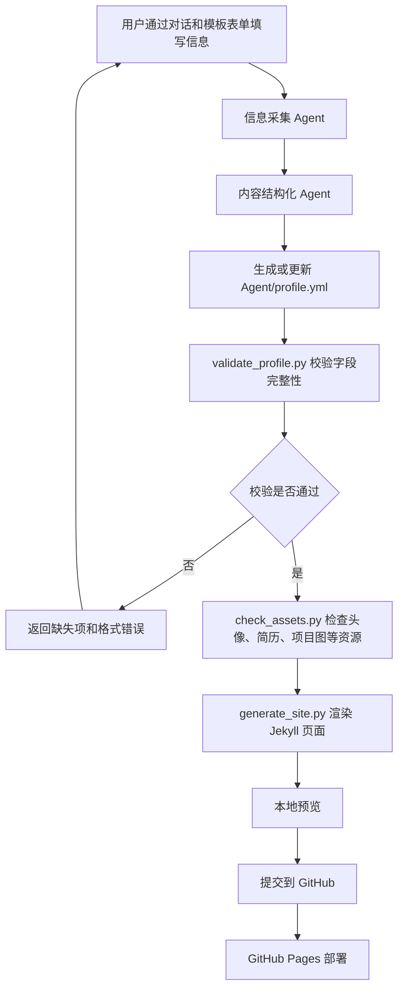

# AI 个人主页定制 Agent 技术设计文档

## 1. 技术目标

本项目的技术目标是把现有个人主页模板升级为一个可复用的 Agent 项目：用户通过对话和模板表单提供个人信息，Agent 将信息整理为统一的 `Agent/profile.yml`，再由确定性的生成脚本把 `Agent/profile.yml` 渲染为 Jekyll 网站文件，最终用户可以本地预览并部署到 GitHub Pages。

MVP 阶段不追求复杂的自动化平台，而是采用更稳妥的路线：

- 使用 GitHub 仓库作为模板项目。
- 使用 `Agent/profile.yml` 作为用户信息的唯一数据源。
- 使用 Agent 辅助用户补齐和检查信息。
- 使用脚本完成校验、页面生成和资源检查。
- 使用 GitHub Pages 完成公开部署。

这种方案的好处是：产品逻辑清晰、实现成本可控、用户能看懂，也适合用于展示“AI 产品 + Agent 工作流 + 工程落地”的能力。

## 2. 总体架构

项目整体分为四层：

```text
用户输入层
  ↓
Agent 信息采集与结构化层
  ↓
Agent/profile.yml 数据层
  ↓
Jekyll 页面生成与部署层
```

具体流程如下：



## 3. 推荐项目目录

为了避免 Agent 项目代码和你当前个人主页的 Jekyll 代码混在一起，MVP 阶段建议把所有 Agent 相关内容统一放到 `WowPage/Agent/` 目录下。外层仍然保留原有个人主页结构，`Agent/` 只负责“采集、校验、生成和说明”。

```text
WowPage/
├── Agent/
│   ├── profile.yml
│   ├── README.md
│   ├── prompts/
│   │   ├── system_prompt.md
│   │   ├── collect_info.md
│   │   ├── validate_profile.md
│   │   └── deploy_helper.md
│   ├── scripts/
│   │   ├── validate_profile.py
│   │   ├── check_assets.py
│   │   ├── generate_summary.py
│   │   └── generate_site.py
│   └── templates/
│       ├── about.md.j2
│       ├── navigation.yml.j2
│       └── config.yml.j2
├── docs/
│   ├── PRD.md
│   └── TECH_DESIGN.md
├── images/
│   ├── avatar.jpg
│   ├── wechat_qr.jpg
│   ├── project_1.png
│   ├── project_2.png
│   └── project_3.png
└── files/
    └── resume.pdf
```

MVP 阶段最关键的是：

- `Agent/profile.yml`
- `Agent/scripts/validate_profile.py`
- `Agent/scripts/check_assets.py`
- `Agent/scripts/generate_summary.py`
- `Agent/scripts/generate_site.py`
- `Agent/templates/about.md.j2`

`Agent/prompts/` 可以先作为产品展示和后续扩展使用，不一定第一版就接入真实 Agent SDK。

## 4. 核心设计原则

### 4.1 `Agent/profile.yml` 是唯一数据源

用户的个人信息只写入 `Agent/profile.yml`。Jekyll 页面文件不再手动散落填写用户信息，而是由生成脚本根据 `Agent/profile.yml` 自动生成。

这样做可以避免后续维护混乱：

- 用户只需要改一个文件。
- Agent 只需要读写一个结构化数据源。
- 页面样式和用户内容解耦。
- 后续更换模板时，可以复用同一份用户数据。

### 4.2 Agent 负责理解和补齐，脚本负责确定性生成

Agent 不直接“随意改代码”，而是主要做三件事：

- 引导用户分阶段填写信息。
- 检查必填项是否缺失。
- 把自然语言信息整理为符合规范的 `Agent/profile.yml`。

脚本负责三件事：

- 校验 `Agent/profile.yml` 是否符合规则。
- 检查本地资源文件是否存在。
- 根据模板生成 Jekyll 页面。

这条边界很重要：Agent 适合处理不确定的输入，脚本适合处理确定的输出。两者组合起来，系统会更稳定。

## 5. `Agent/profile.yml` 数据结构设计

MVP 推荐结构如下：

```yml
site:
  title: "MyWebsite"
  url: ""
  baseurl: ""

profile:
  name: "吴琦"
  avatar: "/images/avatar.jpg"
  bio: "写下我度秒如年难捱的离骚"
  target_role: "AI 产品经理实习生"
  location:
    text: "中国重庆市"
    url: "https://gaode.com/place/B0017875LP"
  school:
    text: "西南大学"
    url: "https://www.swu.edu.cn/"
  email: "552394206@qq.com"
  wechat_id: "your_wechat_id"
  wechat_qr: "/images/wechat_qr.jpg"
  github: ""
  blog: ""

intro:
  greeting: "你好👋 欢迎来到我的主页！"
  summary:
    - "Hi！我是吴琦，目前就读于西南大学信息管理与信息系统专业。"
    - "我正在寻找 AI 产品岗位的实习机会，对 Agent、AI 工具和产品创新非常感兴趣。"

news:
  - date: "2026.06"
    content: "基金收益突破 2k。"

education:
  school: "西南大学"
  major: "信息管理与信息系统"
  degree: "本科"
  start: "2023.09"
  end: "2027.06"
  description: "可选补充说明"

internships:
  - company: "公司名称"
    role: "岗位名称"
    start: "2025.07"
    end: "2025.09"
    summary: "用于主页展示的一到两句话总结。"
    bullets:
      - "实习要点 1"
      - "实习要点 2"
      - "实习要点 3"
      - "实习要点 4"

projects:
  - name: "项目名称"
    role: "产品负责人 / 开发者"
    image: "/images/project_1.png"
    summary: "用于主页展示的一到两句话总结。"
    links:
      project: ""
      code: ""
    star:
      situation: "项目背景"
      task: "承担任务"
      action: "具体行动"
      result: "项目结果"

awards:
  - date: "2025.12"
    content: "西南大学一等奖学金"

student_work:
  - start: "2024.09"
    end: "2025.09"
    role: "创新创业部部长"
    organization: "西南大学某组织"
    content: "负责活动策划、项目推进和跨团队协作。"

skills:
  - name: "产品设计"
    tags:
      - "PRD"
      - "原型设计"
      - "需求分析"
  - name: "AI 工具"
    tags:
      - "ChatGPT"
      - "Codex"
      - "Cursor"

resume:
  path: "/files/resume.pdf"
```

## 6. 字段校验规则

### 6.1 必填字段

以下字段必须存在且不能为空：

- `profile.name`
- `profile.avatar`
- `profile.bio`
- `profile.target_role`
- `profile.location.text`
- `profile.school.text`
- `profile.email`
- `profile.wechat_id`
- `intro.greeting`
- `intro.summary`
- `education`
- `projects`
- `skills`
- `resume.path`

### 6.2 选填字段

以下字段可以为空：

- `profile.github`
- `profile.blog`
- `profile.wechat_qr`
- `news`
- `awards`
- `student_work`
- `projects[].links.project`
- `projects[].links.code`

### 6.3 数量规则

- `news`：最多 10 条；为空则隐藏“最新动态”模块。
- `education`：只允许 1 条。
- `internships`：最多 2 条；可以为 0 条。
- `projects`：至少 1 条，最多 3 条。
- `skills`：至少 3 个，最多 6 个。

### 6.4 经历规则

实习经历：

- 不强制 STAR。
- 每段实习经历必须包含 4 条要点。
- 每段实习经历必须包含 `summary`，用于主页展示，建议一到两句话。
- 若少于 4 条，Agent 提醒用户补齐。
- 主页展示时不直接展开 4 条要点，而是展示 `summary`。

项目经历：

- 强制使用 STAR 结构。
- 每个项目必须包含 4 个字段：
  - `situation`
  - `task`
  - `action`
  - `result`
- 每个项目必须包含 `summary`，用于主页展示，建议一到两句话。
- 若任一字段为空，Agent 提醒用户补齐。
- 主页展示时不直接展开 STAR 四项，而是展示 `summary`。

## 7. 资源文件规则

MVP 阶段约定所有资源使用固定命名，降低用户理解成本。

| 资源类型 | 固定路径 | 是否必填 |
| --- | --- | --- |
| 头像 | `/images/avatar.jpg` | 必填 |
| 微信二维码 | `/images/wechat_qr.jpg` | 选填 |
| 项目图 1 | `/images/project_1.png` | 项目 1 建议提供 |
| 项目图 2 | `/images/project_2.png` | 项目 2 建议提供 |
| 项目图 3 | `/images/project_3.png` | 项目 3 建议提供 |
| 简历 PDF | `/files/resume.pdf` | 必填 |

如果用户未提供微信二维码：

- 点击 WeChat 时复制微信号。

如果用户提供微信二维码：

- 点击 WeChat 时弹出二维码。

## 8. 脚本设计

### 8.1 `validate_profile.py`

职责：

- 读取 `Agent/profile.yml`。
- 检查必填字段。
- 检查数量限制。
- 检查项目 STAR 字段。
- 检查实习经历 4 条要点。
- 输出清晰的错误提示。

示例输出：

```text
Agent/profile.yml 校验失败：
1. projects[0].star.result 不能为空
2. internships[0].bullets 必须包含 4 条，目前只有 3 条
3. skills 至少需要 3 个，目前只有 2 个
```

校验通过时输出：

```text
Agent/profile.yml 校验通过。
```

### 8.2 `check_assets.py`

职责：

- 检查 `/images/avatar.jpg` 是否存在。
- 检查 `/files/resume.pdf` 是否存在。
- 根据项目数量检查对应项目图片。
- 如果 `profile.wechat_qr` 不为空，检查二维码图片是否存在。

示例输出：

```text
资源检查失败：
1. 缺少头像文件：images/avatar.jpg
2. 缺少简历文件：files/resume.pdf
```

### 8.3 `generate_site.py`

职责：

- 读取 `Agent/profile.yml`。
- 读取 Jinja2 模板。
- 生成 `_pages/about.md`。
- 必要时生成 `_data/navigation.yml`。
- 必要时更新 `_config.yml` 的站点标题、baseurl 等配置。

MVP 阶段建议先只生成 `_pages/about.md`，减少对现有 Jekyll 结构的扰动。

### 8.4 `generate_summary.py`

职责：

- 读取 `Agent/profile.yml`。
- 找到缺失 `summary` 的实习经历和项目经历。
- 调用 DeepSeek API，根据实习四点或项目 STAR 四项生成一到两句话的主页展示总结。
- 将生成结果写回 `Agent/profile.yml`。

设计原则：

- API Key 只从环境变量 `DEEPSEEK_API_KEY` 读取，不写入代码和仓库。
- 默认只生成缺失的 `summary`，避免覆盖用户已经手动调整过的展示文案。
- 如需重新生成所有 summary，可使用 `--force`。
- 如需只预览、不写回，可使用 `--dry-run`。

推荐命令：

```powershell
$env:DEEPSEEK_API_KEY="你的 DeepSeek API Key"
python Agent\scripts\generate_summary.py
```

## 9. 模板设计

### 9.1 `Agent/templates/about.md.j2`

用于生成主页正文。

模板负责：

- 渲染个人介绍。
- 根据 `news` 是否为空决定是否显示“最新动态”。
- 渲染教育/实习经历。
- 渲染项目经历。
- 根据 `awards` 是否为空决定是否显示“荣誉奖项”。
- 根据 `student_work` 是否为空决定是否显示“学生工作”。
- 渲染技能标签。
- 渲染简历入口。

### 9.2 `Agent/templates/navigation.yml.j2`

用于生成导航栏。

MVP 固定导航顺序：

```text
MyWebsite
最新动态
教育/实习经历
项目经历
荣誉奖项
学生工作
技能标签
个人简历
```

如果某个模块为空，导航栏中也应隐藏对应入口。

### 9.3 `Agent/templates/config.yml.j2`

用于生成或辅助更新 `_config.yml`。

MVP 阶段不建议全量覆盖 `_config.yml`，只在必要时更新：

- `title`
- `url`
- `baseurl`
- `author` 相关字段

## 10. Agent 分工设计

### 10.1 信息采集 Agent

负责引导用户分阶段填写信息。

阶段建议：

1. 基础信息
2. 教育背景
3. 实习经历
4. 项目经历
5. 荣誉奖项和学生工作
6. 技能标签
7. 资源文件
8. 部署信息

### 10.2 内容结构化 Agent

负责把用户自然语言输入整理为 `Agent/profile.yml`。

它不负责改写内容，只负责：

- 提取字段。
- 归类模块。
- 保持格式统一。
- 发现缺失项。

### 10.3 文案整理 Agent

MVP 阶段暂不做主动改写。

后续版本可以支持：

- 根据目标岗位优化表达。
- 将项目经历改写为更适合产品岗的表述。
- 生成不同版本，例如 AI 产品版、数据产品版、后端开发版。

### 10.4 页面生成 Agent

负责调用生成脚本，并解释生成结果。

它可以告诉用户：

- 哪些页面被更新。
- 哪些模块被隐藏。
- 哪些资源文件缺失。
- 如何本地预览。

### 10.5 风格定制 Agent

MVP 阶段固定使用当前个人主页风格：简洁白色、卡片化排版、轻量毛玻璃效果。

后续可以支持：

- 极简风
- 科技蓝紫风
- 学术简历风
- 产品作品集风

### 10.6 部署指导 Agent

负责输出 GitHub Pages 部署顺序，包括：

1. 创建 GitHub 仓库。
2. 上传项目代码。
3. 检查 `_config.yml` 中的 `url` 和 `baseurl`。
4. 在 GitHub Pages 中选择 `Deploy from a branch`。
5. 选择 `main` 和 `/root`。
6. 等待 Actions 构建完成。
7. 访问 GitHub Pages 链接。

## 11. 用户使用流程

MVP 用户流程：

```text
1. 用户 fork 或复制模板仓库
2. 用户准备头像、简历、项目图等资源
3. 用户通过 Agent 填写信息
4. Agent 生成 `Agent/profile.yml`
5. 用户运行校验命令
6. 用户运行生成命令
7. 用户本地预览
8. 用户提交并推送到 GitHub
9. GitHub Pages 自动部署
```

推荐命令：

```bash
python Agent/scripts/validate_profile.py
python Agent/scripts/check_assets.py
python Agent/scripts/generate_summary.py
python Agent/scripts/generate_site.py
bundle exec jekyll serve
```

Windows PowerShell 中可以使用：

```powershell
python Agent\scripts\validate_profile.py
python Agent\scripts\check_assets.py
python Agent\scripts\generate_summary.py
python Agent\scripts\generate_site.py
bundle exec jekyll serve
```

## 12. GitHub Pages 部署策略

MVP 使用 GitHub Pages 的分支部署：

- Source：Deploy from a branch
- Branch：`main`
- Folder：`/root`

如果仓库名不是 `username.github.io`，则 `_config.yml` 中需要配置：

```yml
url: "https://你的用户名.github.io"
baseurl: "/你的仓库名"
```

例如：

```yml
url: "https://w1useven7.github.io"
baseurl: "/Personal-Website"
```

## 13. 异常处理

### 13.1 必填字段缺失

Agent 不直接生成页面，而是提醒用户补齐缺失项。

示例：

```text
还缺少以下必填信息：
1. 微信号
2. 简历 PDF
3. 至少 1 个项目经历
```

### 13.2 项目经历不完整

如果项目经历没有完整 STAR 四项，Agent 提醒补齐。

示例：

```text
你的第 1 个项目还缺少 Result 部分。
请补充这个项目最终产生了什么结果，例如上线、用户反馈、数据提升、作品交付等。
```

### 13.3 实习经历要点不足

如果实习经历少于 4 条要点，Agent 提醒补齐。

```text
你的第 1 段实习经历目前只有 3 条要点，MVP 规范要求 4 条。
请再补充 1 条和工作产出或协作相关的内容。
```

### 13.4 资源文件缺失

如果头像或简历缺失，生成流程中断。

如果项目图或微信二维码缺失，可以给出警告，但不一定中断。

## 14. MVP 技术边界

MVP 阶段暂不做：

- 在线账号系统。
- 在线表单后台。
- 多用户数据库。
- 自动购买或配置域名。
- 自动创建 GitHub 仓库。
- 自动推送 GitHub。
- 多套视觉主题。
- 复杂的文案重写。
- 自动解析 PDF 简历。

MVP 阶段重点验证：

- 用户能否通过 Agent 顺利生成个人主页。
- `Agent/profile.yml` 是否足够表达求职主页信息。
- 页面生成链路是否稳定。
- GitHub Pages 部署流程是否足够低门槛。

## 15. 后续迭代方向

### 15.1 表单化输入

将 `Agent/profile.yml` 的填写过程变成网页表单，降低非技术用户使用门槛。

### 15.2 简历 PDF 解析

允许用户上传简历 PDF，Agent 自动提取教育、项目、实习、技能等字段。

### 15.3 多岗位版本

支持同一用户生成不同版本主页：

- AI 产品版
- 数据产品版
- 后端开发版
- 算法实习版

### 15.4 多主题切换

支持用户选择不同视觉风格：

- 极简白色
- 蓝紫科技
- 学术简历
- 产品作品集

### 15.5 一键部署

后续可以接入 GitHub API，实现：

- 自动创建仓库。
- 自动提交文件。
- 自动配置 GitHub Pages。
- 自动返回访问链接。

## 16. 第一阶段开发清单

建议下一阶段按以下顺序开发：

1. 新建 `Agent/profile.yml` 示例文件。
2. 新建 `Agent/scripts/validate_profile.py`。
3. 新建 `Agent/scripts/check_assets.py`。
4. 新建 `Agent/scripts/generate_summary.py`，支持调用 DeepSeek 自动补全展示总结。
5. 新建 `Agent/templates/about.md.j2`。
6. 新建 `Agent/scripts/generate_site.py`。
7. 用当前个人主页内容反向填充一份默认 `Agent/profile.yml`。
8. 跑通从 `Agent/profile.yml` 到外层 `_pages/about.md` 的生成流程。
9. 编写 `Agent/prompts/` 下的提示词文件。
10. 编写用户使用说明。

第一阶段完成后，这个项目就不再只是“一个个人主页”，而是具备了 Agent 项目的基础形态：有用户输入、有结构化数据、有校验规则、有自动生成、有部署路径。
